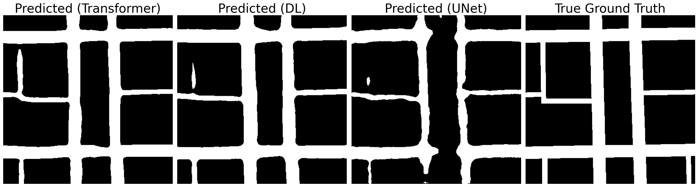

# RoadFormer: Road Segmentation using Transformers

This repository contains the implementation and analysis of the **RoadFormer** project, developed for road segmentation from aerial imagery. The work explores and evaluates various machine learning architectures, including Convolutional Neural Networks (CNNs) and Transformer-based models, enhanced with data augmentation, ensemble learning, and post-processing techniques like Conditional Random Fields (CRFs).

---

## Reproducibility

In order to rerun the code and reproduce the AI Crowd scores, use the files `segformer_train.py` and `segformer_evaluate.py`. These scripts contain the complete setup and configurations required for training and evaluating the SegFormer model, and generating the submission file.

---

## Overview

Road segmentation is a crucial task in computer vision and geospatial analysis. It has broad applications, such as autonomous driving, urban planning, and GIS mapping. In this project, we focused on segmenting roads from aerial images using machine learning models.

Key components of the project include:
- **Model Architectures:** Implementation of U-Net, DeepLabv3+, and SegFormer models.
- **Post-Processing:** Utilized Morphological Operations and Conditional Random Fields (CRFs) for refining segmentation outputs.
- **Ensemble Learning:** Combined predictions from multiple models using majority voting to improve results.
- **Data Augmentation:** Applied geometric transformations, random crops, image degradations, and color transforms to enhance training data diversity.

---

## Features

- Semantic segmentation using state-of-the-art CNN and Transformer models.
- Comprehensive performance evaluation of individual models and their ensemble.
- Advanced post-processing techniques to refine segmentation.
- Ethical risk assessment and sustainability considerations in machine learning projects.

## Post-Processing

Post-processing techniques were applied to refine the outputs of the segmentation models and improve overall performance. Two primary approaches were utilized:

### 1. Morphological Operations

Morphological operations such as erosion, dilation, opening, and closing were employed to enhance the smoothness of the binary segmentation outputs. These techniques are especially useful for correcting small errors in road boundaries. 

- **Erosion and Dilation:** These operations adjust the size of detected road regions. While erosion removes small false positives, dilation expands true positives.
- **Opening and Closing:** Combined operations were used to balance removal of noise and preservation of road shapes, providing minor improvements in segmentation accuracy.

### 2. Conditional Random Fields (CRFs)

Conditional Random Fields were used as a refinement step to improve the connectivity and sharpness of road segment predictions:
- **Pairwise Gaussians:** Fully-connected CRFs applied pairwise Gaussian potentials to penalize discontinuities between nearby pixels, enhancing smoothness and connectivity of road networks.
- **Custom Hyperparameters:** Specific tuning of CRF parameters improved performance by adapting to the long and thin nature of roads, as well as their orientation.

CRFs demonstrated their utility in filling gaps in road segments and ensuring that road edges were more sharply defined. However, care was needed to avoid over-smoothing, particularly in areas with complex road intersections.

Overall, the combination of these post-processing techniques resulted in more polished and accurate segmentation outputs.

### Output of the models & Comparison with groundtruth




---

## Usage

### Main files for reproducibility

The two main files for the training and use of the SegFormer model are as follows:
To train the SegFormer model:
```bash
segformer_train.py
```
subsequently to evaluate and create the submissions:
```bash
segformer_evaluate.py
```

### Other relevant files

The data augmentation functions are found in:
```bash
data_augmentation.py
```
The data augmentation itself is done in:
```bash
data_augmentation.ipynb
```

The post-processing can also be followed in:
```bash
post_processing.ipynb
```

Experiments on majority voting are found in:
```bash
majority_voting.ipynb
```

Files pertaining to the DeepLabV3+ model are in:
```bash
DeepLabV3Plus.ipynb
```
and
```bash
DeepLabV3Plus_test.ipynb
```

All data is stored in the folder:
```bash
data
```
This includes training, validation, and test data.
Data augmentations are stored in their respective folders within the training and validation folders.

All relevant models are in the folder:
```bash
models
```
Among these, the highest-performing model is the model:
```bash
finetuned_segformer_15_geocropdeg.pth
```

Finally, a set of submissions can be found in the folder:
```bash
submissions
```
Among these, the final result is:
```bash
submission_postprocessed2_segformer_ft_geocropdeg_15.csv
```

## Results

### Performance Metrics

| Model         | F1-Score | Accuracy | Precision | Recall  |
|---------------|----------|----------|-----------|---------|
| U-Net         | 0.8148   | 0.9269   | 0.8803    | 0.7584  |
| DeepLabV3+    | 0.8608   | 0.9409   | 0.8595    | 0.8621  |
| **SegFormer** | **0.8766** | **0.9484** | **0.8893** | **0.8642** |
| Ensemble      | 0.8726   | 0.9474   | 0.8981    | 0.8484  |

Our best-performing model, **SegFormer**, achieved the highest F1 score and accuracy, demonstrating its effectiveness in accurately identifying road segments.

---

## Ethical Considerations

- **Privacy Risks:** Satellite or aerial imagery may capture private properties, posing potential privacy concerns. Mitigation strategies, such as geospatial cryptography, can address these risks.
- **Fairness Issues:** The dataset primarily contains roads from Western landscapes, leading to possible biases. Expanding the dataset to include roads from diverse regions would improve fairness.
- **Sustainability:** The training process utilized limited computational resources, minimizing environmental impact.

---

## Future Work

- Increase dataset diversity to include underrepresented road designs and regions.
- Enhance post-processing methods to handle complex and curved road patterns.
- Explore graph-based approaches for further segmentation improvements.

---

## Authors

- Arda Civelekoglu
- Arnault Stähli
- Guillen Steulet

---

## License

This project is licensed under the MIT License. See `LICENSE` for more details.